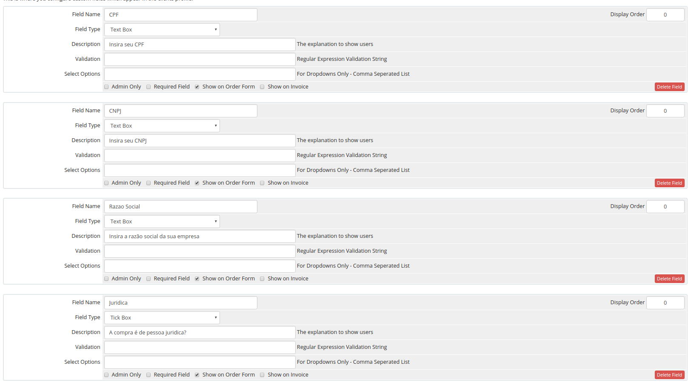

# Módulo de Integração Gerencianet para WHMCS Oficial - Versão 0.1.0 #

O módulo Gerencianet para o WHMCS permite gerar boletos com registro através da nossa API.
Compatível com as versões superiores à 6.0.4 do WHMCS.

Este é o Módulo Oficial de integração fornecido pela [Gerencianet](https://gerencianet.com.br/) para WHMCS. Com ele, o responsável pela conta WHMCS pode receber pagamentos por boleto bancário e, assim que a cobrança tem uma confirmação de pagamento ou é cancelada, a Gerencianet envia uma notificação automática para o WHMCS.

Caso você tenha alguma dúvida ou sugestão, entre em contato conosco pelo site [Gerencianet](https://gerencianet.com.br/).

## Instalação

1. Faça o download da última versão do módulo;
2. Descompacte o arquivo baixado;
3. Copie o arquivo gerencianetcharge.php e a pasta gerencianet_lib, disponíveis na pasta gn-api-whmcs, para o diretório /modules/gateways da instalação do WHMCS;
4. Copie o arquivo gerencianetcharge.php, disponível no diretório gn-api-whmcs/callback, para o diretorio modules/gateways/callback. Ele deve seguir o modelo modules/gateways/callback/gerencianetcharge.php.

Os arquivos do módulo Gerencianet devem seguir a seguinte estrutura no WHMCS:

```
 modules/gateways/
  |- callback/gerencianetcharge.php
  |  gerencianet_lib/
  |  gerencianetcharge.php
```

## Configuração do Módulo


1. Dentro do painel administrativo do WMCS, acesse o menu "Setup" -> "Payments" -> "Payment Gateways";
2. No campo "Active Module", escolha a opção Gerencianet;
3. Configure as credenciais de sua Aplicação Gerencianet. Para criar uma nova Aplicação, entre em sua conta Gerencianet, acesse o menu "API" e clique em "Minhas Aplicações" -> "Nova aplicação". Insira as credenciais disponíveis neste link (Client ID e Client Secret de produção e desenvolvimento) nos respectivos campos de configuração do módulo;
4. Informe o usuário administrador do WHMCS no respectivo campo; 
5. Informe o desconto (Porcentagem ou valor fixo) que deverá ser aplicado aos boletos gerados exclusivamente pela Gerencianet. Esta informação é opcional;
6. Informe o número de dias corridos para o vencimento da cobrança após a mesma ser gerada. Se o campo estiver vazio, o valor será 0;
7. Caso seja de seu interesse, habilite o ambiente de testes da API Gerencianet através de campo "Sandbox";
8. Habilite os logs de transação e de erros da Gerencianet no painel WHMCS através do campo "Debug";
9. Configure as intruções do boleto que sejam de seu interesse;
10. Salve as configurações.

## Configuração no WHMCS

Para que o módulo funcione corretamente será necessária a criação de alguns campos no WHMCS. Para isto, acesse "Setup" -> "Custom Client Fields", no painel administrativo do WHMCS, e crie os seguintes campos customizados para seus clientes:

### Campos obrigatórios:

1. "CPF" : Representa o CPF do cliente - O tipo deve ser "Text Box";

O campo "CPF" é obrigatório devido à uma exigência do banco central para emissão de boletos com registro. 

### Campos opcionais (Caso você queira disponibilizar para seus clientes a opção de compra como Pessoa Jurídica).

1. "CNPJ" : Representa o CNPJ do Cliente - O tipo deve ser "Text Box";
2. "Razao Social" : Representa a Razão Social do empresa que pertence ao cliente - O tipo deve ser "Text Box";
3. "Juridica" : Através desta opção o cliente irá escolher se deseja fazer a compra como Pessoa Jurídica ou não - O tipo deve ser "Tick Box".

Obs: Os campos citados acima devem ter exatamente o mesmo nome no WHMCS, sem acentos ou caracteres especiais.



#Erros de Integração:

Antes mesmo do módulo tentar gerar uma cobrança alguns campos requisitados na integração passam por uma validação. Os erros que esta validação pode retornar são:

1. **Nome Inválido:** O nome informado pelo cliente final é muito curto, assim, o mesmo deve digitar o nome completo;
2. **Email Inválido:** O email informado pelo cliente final é inválido (não segue o padrão xxxxx@xxxx.com) ou não existe;
3. **Telefone Inválido:** O telefone informado pelo cliente final não existe ou o DDD está incorreto;
4. **CPF Inválido:** O número do CPF do cliente final é invalido;
5. **CPF Nulo:** O campo "CPF" não existe no WHMCS ou não está preenchido;
6. **CNPJ Inválido:** O número do CNPJ do cliente final é invalido;
7. **CNPJ Nulo:** O campo "CNPJ" não existe no WHMCS ou não está preenchido;
8. **Razão Social Inválida:** A Razão Social é inválida. O cliente deve digitar o nome que consta na Receita Federal;
9. **Razão Social Nula:** O campo "Razao Social" não existe no WHMCS ou não está preenchido;
10. **Erro Inesperado:** Houve algum erro na integração. Provavelmente você não preencheu todos os campos do módulo corretamente, ou a versão do PHP do WHMCS não é compatível com a API Gerencianet. Você deverá ativar o modo Debug do módulo para saber mais detalhes.

Ainda que nenhum destes erros de validação seja retornados, a API Gerencianet poderá retornar erros referentes à geração da cobrança. Para mais informações sobre os códigos de erros retornados pela API Gerencianet, [acesse](https://docs.gerencianet.com.br/codigos-de-erros).

Descontos:

Neste módulo de integração é possível gerar boletos considerando os descontos dos cupons promocionais fornecidos pelo WHMCS.
Caso o integrador escolha uma das 4 formas de desconto do WHMCS (Porcentagem, valor fixo, Substituição de preço e isenção de tarifas), tal desconto é convertido em Reais e repassado à API Gerencianet no momento da geração do boleto.

Além dos descontos fornecidos pelo WHMCS, é possível disponibilizar descontos exclusivos para os boletos gerados através do módulo Gerencianet. Esta opção de desconto é configurada nos campos "Descoto do Boleto" e "Tipo de deconto" do módulo Gerencianet. Uma vez configurado, este disconto será exibido no boleto Gerencianet e, assim que o mesmo for pago, o valor do pedido e da cobrança no WHMCS serão atualizados para o valor com o desconto Gerencianet.

## Requisitos

* Versão mínima do PHP: 5.4.39
* Versão mínima do WHMCS: 6.0.4


