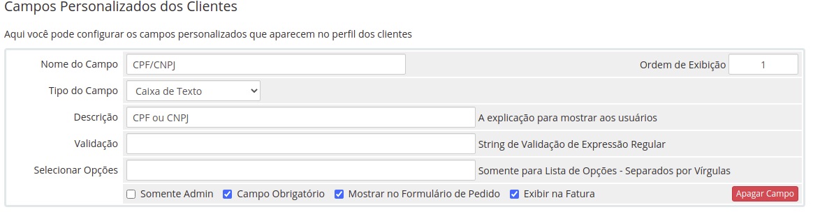

# Módulo de Integração Gerencianet para WHMCS Oficial

O módulo Gerencianet para o WHMCS permite gerar boletos com registro por meio da nossa API.
Compatível com as versões superiores a 6.0.4 do WHMCS.

Este é a versão oficial do módulo de integração fornecido pela [Gerencianet](https://gerencianet.com.br/) para WHMCS. Com ele, o responsável pela conta WHMCS pode receber pagamentos por boleto bancário e, assim que a cobrança tem uma confirmação de pagamento ou é cancelada, a Gerencianet envia uma notificação automática para o WHMCS.

Caso você tenha alguma dúvida ou sugestão, entre em contato conosco pelo site [Gerencianet](https://gerencianet.com.br/).

## Instalação

1. Faça o download da última versão do módulo [aqui](https://codeload.github.com/gerencianet/gn-api-whmcs/zip/master);
2. Descompacte o arquivo baixado;
3. Copie o arquivo gerencianetcharge.php e a pasta gerencianet_lib, disponíveis na pasta gn-api-whmcs, para o diretório /modules/gateways da instalação do WHMCS;
4. Copie o arquivo gerencianetcharge.php, disponível no diretório gn-api-whmcs/callback, para o diretório modules/gateways/callback. Ele deve seguir o modelo modules/gateways/callback/gerencianetcharge.php.
5. Copie o arquivo gerencianet.php, disponível no diretório gn-api-whmcs/hooks, para o diretório includes/hooks. Ele deverá seguir o modelo includes/hooks/gerencianet.php

Os arquivos do módulo Gerencianet devem seguir a seguinte estrutura no WHMCS:

```
 includes/hooks/
  |- gerencianet.php
 modules/gateways/
  |- callback/gerencianetcharge.php
  |  gerencianet_lib/
  |  gerencianetcharge.php
```

Obs: O passo 5 é opcional, devendo ser seguido apenas se o administrador do WHMCS desejar que as faturas atualizadas no WHMCS também tenham seu status atualizados automaticamente na Gerencianet.
## Configuração do Módulo


Dentro do painel administrativo do WHMCS, acesse o menu "Setup" -> "Payments" -> "Payment Gateways". No campo "Active Module", escolha a opção Gerencianet. A tela mostrada acima será exibida. Dentro do formulário, você deverá preencher os seguintes campos:

1. **Client_Id Produção:** Deve ser preenchido com o client_id de produção de sua conta Gerencianet. Este campo é obrigatório e pode ser encontrado no menu "API" -> "Minhas Aplicações". Em seguida, selecione sua aplicação criada, conforme é mostrado no [link](http://image.prntscr.com/image/7dc272063bb74dccba91739701a0478b.png);
2. **Client_Secret Produção:** Deve ser preenchido com o client_secret de produção de sua conta Gerencianet. Este campo é obrigatório e pode ser encontrado no menu "API" ->  "Minhas Aplicações". Em seguida, selecione sua aplicação criada, conforme é mostrado no [link](http://image.prntscr.com/image/7dc272063bb74dccba91739701a0478b.png);
3. **Client_Id Desenvolvimento:** Deve ser preenchido com o client_id de desenvolvimento de sua conta Gerencianet. Este campo é obrigatório e pode ser encontrado no menu "Nova API" -> "Minhas Aplicações". Em seguida, selecione sua aplicação criada, conforme é mostrado no [link](http://image.prntscr.com/image/447be4bc64644a35bcf5eaecd1125f5d.png);
4. **Client_Secret Desenvolvimento:** Deve ser preenchido com o client_secret de desenvolvimento de sua conta Gerencianet. Este campo é obrigatório e pode ser encontrado no menu "Nova API" -> "Minhas Aplicações". Em seguida, selecione sua aplicação criada, conforme é mostrado no [link](http://image.prntscr.com/image/447be4bc64644a35bcf5eaecd1125f5d.png);;
5. **Identificador da Conta:** Deve ser preenchido com o identificador de sua conta Gerencianet. Este campo é obrigatório e pode ser encontrado no menu "API", na tela principal e no canto superior esquerdo, conforme é mostrado no [link](http://image.prntscr.com/image/cabe13e1e5b64449b942cf31139150ba.png);
6. **Usuario administrador do WHMCS:** Deve ser preenchido com o usuário administrador do WHMCS. É necessário utilizar o mesmo usuário que o administrador do WHMCS utiliza para fazer login na área administrativa de sua conta. Este campo é de preenchimento obrigatório; 
7. **Desconto do Boleto:** Informe o valor desconto que deverá ser aplicado aos boletos gerados exclusivamente pela Gerencianet. Esta informação é opcional;
8. **Tipo de desconto:** Informe o tipo de desconto (porcentagem ou valor fixo) que deverá ser aplicado aos boletos gerados exclusivamente pela Gerencianet. Esta informação é opcional; 
9. **Numero de dias para o vencimento da cobrança:** Informe o número de dias corridos para o vencimento do boleto Gerencianet após a cobrança ser gerada. Se o campo estiver vazio, o valor será 0;
10. **Nome do campo referente ao CPF e/ou CNPJ:** Deve ser informado o nome do campo que o administrador do WHMCS criou para receber o CPF e/ou CNPJ do cliente final. Este campo é obrigatório e, caso você ainda não o tenha criado, vá ao painel administrativo do WHMCS em "Setup" -> "Custom Client Fields" e configure um campo para receber tais valores. Ex: "CPF/CNPJ".
11. **Valor mínimo da fatura:** Neste campo deve ser informado o valor mínimo da fatura no WHMCS para que o boleto Gerencianet seja gerado. Assim, caso você queira limitar a geração de transações na Gerencianet para faturas do WHMCS com valores superiores à R$ 7,00, por exemplo, você deverá preencher este campo com "7.00". O desconto oferecido no módulo pela Gerencianet (Vide Campo 7) não está incluido no cálculo deste valor minimo.
12. **Sandbox:** Caso seja de seu interesse, habilite o ambiente de testes da API Gerencianet;
13. **Debug:** Neste campo é possível habilitar os logs de transação e de erros da Gerencianet no painel WHMCS;
14. **E-mail de cobrança - Gerencianet:** Caso seja de seu interesse, habilite o envio de emails de cobrança da Gerencianet para o cliente final;
15. **Configuração de Multa:** Caso seja de seu interesse, informe o valor, em porcentagem, cobrado de multa após o vencimento. Por exemplo: se você quiser 2%, você deve informar 2. Mínimo de 0.01 e máximo de 10. Integer.
16. **Configuração de Juros:**  valor cobrado de juros por dia após a data de vencimento. Por exemplo: se você quiser 0,033%, você deve informar 0.033. Mínimo de 0.001 e máximo de 0.33;
17. **Observação:** Permite incluir no boleto uma mensagem para o cliente;

## Configuração de Campo Personalizado

- Para que o módulo funcione, é necessário um campo de cliente personalizado, que receberá os valores para CPF ou CNPJ.  
- No painel administrativo do WHMCS, acesse: "Opções" >> "Campos Personalizados" >>  "Adicionar". Insira um novo campo, exemplo:



# Erros Comuns de Integração:

Antes mesmo do módulo tentar gerar uma cobrança alguns campos requisitados na integração passam por uma validação. Os erros que esta validação podem retornar são:

1. **Nome Inválido:** O nome informado pelo cliente final é muito curto, assim, deve ser informado o nome completo;
2. **E-mail Inválido:** O email informado pelo cliente final é inválido (não segue o padrão xxxxx@xxxx.com) ou não existe;
3. **Telefone Inválido:** O telefone informado pelo cliente final não existe ou o DDD está incorreto;
4. **Documento Inválido:** O número do CPF/CNPJ do cliente final é invalido;
5. **Documento Nulo:** O campo referente ao CPF e/ou CNPJ do cliente não existe no WHMCS ou não está preenchido;
8. **Razão Social Inválida:** A Razão Social é inválida. O cliente deve digitar no campo "Empresa" do WHMCS o nome empresarial que consta na Receita Federal;
9. **Razão Social Nula:** O campo "Empresa" do WHMCS não está preenchido;
10. **Erro Inesperado:** Houve algum erro na integração. Provavelmente você não preencheu todos os campos do módulo corretamente, ou a versão do PHP do WHMCS não é compatível com a API Gerencianet. Você deverá ativar o modo Debug do módulo para saber mais detalhes.

Ainda que nenhum destes erros de validação sejam retornados, a API Gerencianet poderá retornar erros referentes à geração da cobrança. Para mais informações sobre os códigos de erros retornados pela API Gerencianet, [clique aqui](https://docs.gerencianet.com.br/codigos-de-erros).

## Descontos:

Neste módulo de integração é possível gerar boletos considerando os descontos dos cupons promocionais fornecidos pelo WHMCS.
Caso o integrador escolha uma das 4 formas de desconto do WHMCS (Porcentagem, valor fixo, Substituição de preço e isenção de tarifas), tal desconto é convertido em Reais e repassado à API Gerencianet no momento da geração do boleto.

Além dos descontos fornecidos pelo WHMCS, é possível disponibilizar descontos exclusivos para os boletos gerados por meio do módulo Gerencianet. Esta opção de desconto é configurada nos campos "Desconto do Boleto" e "Tipo de desconto" do módulo Gerencianet. Uma vez configurado, este desconto será exibido no boleto Gerencianet e, assim que for pago, o valor do pedido e da cobrança no WHMCS será atualizado para o valor com o desconto Gerencianet.

Outra forma de desconto além das citadas anteriormente são os créditos que o usuário tem no WHMCS. Assim, caso um cliente queira aplicar um determinado crédito no pedido do WHMCS, tal quantia será convertida em desconto no boleto Gerencianet. 

## Novidades

A partir da versão 0.2.7 do módulo Gerencianet/WHMCS foi disponibilizado o callback automático do WHMCS para a Gerencianet nos casos de cancelamento da fatura e de atualização da data de vencimento do boleto. Portanto, sempre que uma fatura for cancelada no WHMCS ela é automáticamente cancelada na Gerencianet, e sempre que a fatura tem a data de vencimento modificada, o boleto Gerencianet também tem sua data de vencimento atualizada. 

Para ativar o callback automático do WHMCS para a Gerencianet, siga o passo 5 da sessão de Instalação.

Obs: Este módulo foi testado no whmcs 7.1.1 e está funcionando no mesmo.

## Requisitos

* Versão mínima do PHP: 5.4.39
* Versão mínima do WHMCS: 6.0.4
